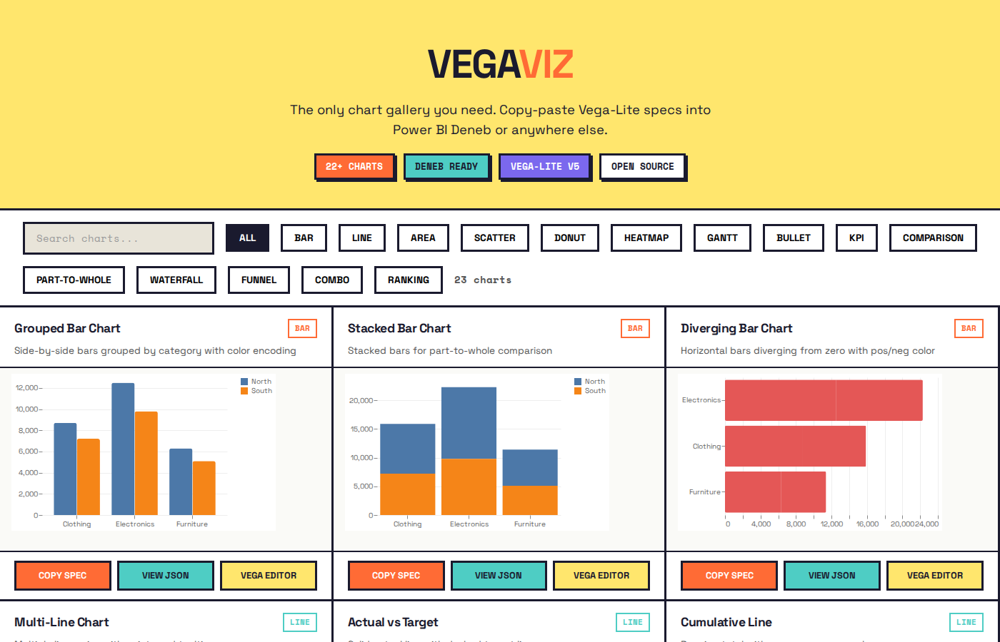

<p align="center">
  <a href="https://codewithbehnam.github.io/vegaviz/">
    
  </a>
</p>

<h1 align="center">vegaviz</h1>

<p align="center">
  <strong>The only Vega & Vega-Lite chart gallery you need.</strong><br>
  Copy-paste specs into Power BI Deneb or anywhere else.
</p>

<p align="center">
  <a href="https://codewithbehnam.github.io/vegaviz/"></a>
  <a href="#charts"></a>
  <a href="https://github.com/CodeWithBehnam/vegaviz/stargazers"></a>
  <a href="LICENSE"></a>
</p>

<p align="center">
  <code>vega-lite</code> · <code>vega</code> · <code>deneb</code> · <code>power-bi</code> · <code>data-visualization</code> · <code>charts</code>
</p>

---

## What is this?

A curated collection of **269+ ready-to-use Vega-Lite and Vega chart specs** — 23 originals plus 246 community contributions from 10 open-source repositories — designed for:

- **Power BI Deneb** custom visual (primary target)
- **Vega Editor** for standalone exploration
- **Any platform** that renders Vega/Vega-Lite specs

Every chart includes a complete `usermeta` block so you can import it directly as a Deneb template with field mapping.

## Charts

| Category | Original | Community | Total | Highlights |
|----------|----------|-----------|-------|------------|
| **Bar** | 3 | 49 | 52 | Grouped, Stacked, Diverging, IBCS, Top-N, Variance |
| **Line** | 4 | 26 | 30 | Multi-Line, Actual vs Target, Cumulative, Sparkline, Slope, Fan, Forecast |
| **Scatter** | 2 | 21 | 23 | Bubble, Boxplot + Jitter, Raincloud, Violin, Regression, Beeswarm |
| **Donut** | 1 | 22 | 23 | Donut, Ring, Patterned Doughnut, IBCS Donut, Multi-Layered, Orbital |
| **Heatmap** | 2 | 21 | 23 | Matrix, Calendar, Risk Matrix, RACI, BCP Risk |
| **Map** | — | 12 | 12 | Spike Map, Hex Map, Globe, Choropleth, Election Maps |
| **Network** | — | 9 | 9 | Force-Directed, Org Tree, Circle Packing, Radial Tree, Tidy Tree |
| **Gantt** | 1 | 7 | 8 | Gantt with today marker, Hierarchical Gantt, Timeline |
| **KPI** | 1 | 6 | 7 | KPI Card, Linear Gauge, Progress Bar, Conditional Cards |
| **Combo** | 1 | 4 | 5 | Bar + Line dual axis, Image Labelled, Radial Combo |
| **Waffle** | 1 | 3 | 4 | Percentage grid, Unit Charts |
| **Waterfall** | 1 | 3 | 4 | Cumulative steps, Financial Waterfall, Period Variance |
| **Bullet** | 1 | 2 | 3 | Actual vs Target ranges, Lipstick Column |
| **Dumbbell** | 1 | 2 | 3 | Two-value connected dot comparison |
| **Funnel** | 1 | — | 1 | Stage-based narrowing |
| **Sankey** | — | 1 | 1 | Income Statement flow |
| **Other** | 2 | 60 | 62 | Tadpole, Rank/Bump, Du Bois Challenges, Nightingale Rose, Fireworks, Parliament |
| **Total** | **23** | **248** | **271** | |

## Quick Start

### In Power BI Deneb

1. Open the [gallery](https://codewithbehnam.github.io/vegaviz/) and find a chart you like
2. Click **Copy Spec** to copy the full JSON
3. In Power BI, add a Deneb visual to your report
4. Paste the spec into the Deneb editor
5. Map your Power BI fields to the `__FieldName__` placeholders

### In Vega Editor

Click **Vega Editor** on any card in the gallery to open it directly in the online editor with live preview.

## Project Structure

```
charts/
  bar/             Grouped, stacked, diverging (originals)
  line/            Line, area, sparkline, actual vs target
  scatter/         Scatter, bubble, boxplot + jitter
  donut/           Donut and pie
  heatmap/         Matrix heatmap, calendar view
  ...              (+ gantt, bullet, kpi, waffle, waterfall, funnel, combo, other)
  community/       246 specs from 10 open-source repositories
    bar/           IBCS, Top-N, variance, infographic columns
    line/          Slope, fan, forecast, stream, ridgeline
    scatter/       Raincloud, violin, regression, beeswarm
    donut/         Ring, patterned, orbital, multi-layered
    heatmap/       Risk matrix, RACI, BCP risk
    map/           Spike, hex, globe, choropleth, election
    network/       Force-directed, org tree, circle packing
    gantt/         Hierarchical gantt, timeline
    kpi/           Linear gauge, progress bar, conditional cards
    ...            (+ combo, waffle, waterfall, bullet, sankey, other)
templates/         Frozen base templates and Power BI theme configs
data/sample/       Sample datasets for testing (sales, timeseries, kpi)
ai_docs/           Deneb API reference for agents and contributors
docs/              Screenshots and assets
```

## Deneb Compatibility

- Targets **Deneb 1.9** (Vega 6.2.0 / Vega-Lite 6.4.1)
- All specs use `"data": {"name": "dataset"}` for Deneb data binding
- Responsive sizing with `"width": "container"` / `"height": "container"`
- Power BI theme colors via `pbiColorNominal`, `pbiColor(index)`, etc.
- Template placeholders use `__FieldName__` pattern for field mapping

## Community Sources

The gallery includes **248 community chart specs** imported from these open-source repositories. Each spec retains full attribution in its `usermeta.information.source` field.

| Source | Charts | Description |
|--------|--------|-------------|
| [PowerBI-tips/Deneb-Templates](https://github.com/PowerBI-tips/Deneb-Templates) | 59 | Community Deneb templates: bar, scatter, heatmap, gantt, radial, raincloud, slope, tree, and more. Authors include Kerry Kolosko, Daniel Marsh-Patrick, Pha Nguyen, and others. |
| [PBI-DataVizzle/Deneb](https://github.com/PBI-DataVizzle/Deneb) | 43 | Deneb templates and snippets: IBCS charts, donut variants, heatmaps, bar/line combos, progress bars, and column charts with images. |
| [PBI-David/Deneb-Showcase](https://github.com/PBI-David/Deneb-Showcase) | 33 | Advanced Vega visualizations: sankey, parliament, force-directed graph, org tree, waffle, bubble, beeswarm, mekko, infographic, fireworks, and starfield. |
| [avatorl/DataViz-Vega](https://github.com/avatorl/DataViz-Vega) | 24 | Vega data art and visualizations by Andrzej Leszkiewicz: nightingale rose, radar, fan chart, warming stripes, globe, population pyramid, and IBCS three-tier. |
| [Flynnxx1/Deneb-Vega-Showcase](https://github.com/Flynnxx1/Deneb-Vega-Showcase) | 22 | Showcase by Ying Fu: Du Bois Challenge 2025 (10 entries), doomsday clock, NL cycling map, US election map, rotatable globe, sleep visualization. |
| [shadfrigui/vega-lite](https://github.com/shadfrigui/vega-lite) | 21 | Vega-Lite visualizations by Shad Frigui: variance analysis, spike maps, FDA inspections, premier league predictions, Du Bois challenge, bullet-like charts. |
| [alexbadiu-insightsinmotion/PBI-Documentation](https://github.com/alexbadiu-insightsinmotion/PBI-Documentation) | 17 | Professional Deneb templates by Greg Philps: space-saving bar, bullet chart, heat map with marginals, linear gauges, IBCS performance, violin, regression, correlation, waterfall. |
| [DL0K-pbi/PMO_toolkit](https://github.com/DL0K-pbi/PMO_toolkit) | 11 | PMO toolkit by Devon Locher: project risk matrix, BCP risk matrix, Gantt chart, quarterly timeline, RACI matrix — all extracted from Power BI .pbix files. |
| [Giammaria/Vega-Visuals](https://github.com/Giammaria/Vega-Visuals) | 8 | Advanced Vega specs by Madison Giammaria: hierarchical gantt (v1 & v2), zoomable circle packing, serpentine timeline, bar brushing, radial line combo. |
| [Giammaria/Vega-Lite-Techniques](https://github.com/Giammaria/Vega-Lite-Techniques) | 8 | Vega-Lite techniques by Madison Giammaria: dynamic data labels, light/dark mode, automatic radial label rotation, contextual y-axis, date explosion, word wrapping. |

## Inspiration & References

This project builds on the incredible work of the Deneb and Vega communities:

| Resource | Description |
|----------|-------------|
| [deneb-viz/deneb](https://github.com/deneb-viz/deneb) | The Deneb custom visual for Power BI. Source of truth for data binding, `usermeta` schema, custom expressions (`pbiColor`, `pbiFormat`), and runtime versions. |
| [PBIQueryous/Deneb](https://github.com/PBIQueryous/Deneb) | Community templates for bar, line, heatmap, IBCS, donut, and dumbbell charts. |
| [thysvdw.github.io](https://thysvdw.github.io/) | 25+ Deneb chart tutorials covering sparklines, bullet charts, boxplots, rank/bump, calendar views, tadpole, and gantt charts. |
| [data-vogue.com](https://data-vogue.com/) | Data visualization showcase and Deneb chart inspiration. |
| [vega/vega-lite](https://github.com/vega/vega-lite) | The Vega-Lite specification and compiler. |
| [vega/vega](https://github.com/vega/vega) | The Vega visualization grammar. |

If you have a Deneb chart repo or tutorial that should be listed here, open an issue or PR.

## Contributing

1. Pick a chart type from the `charts/` directory (or create a new category)
2. Copy `templates/base/vegalite-base.json` as your starting point
3. Use `__FieldName__` placeholders and `pbiColor` schemes
4. Test in [Vega Editor](https://vega.github.io/editor/) with sample data
5. Submit a PR with your spec

## Star History

<a href="https://star-history.com/#CodeWithBehnam/vegaviz&Date">
 <picture>
   <source media="(prefers-color-scheme: dark)" srcset="https://api.star-history.com/svg?repos=CodeWithBehnam/vegaviz&type=Date&theme=dark" />
   <source media="(prefers-color-scheme: light)" srcset="https://api.star-history.com/svg?repos=CodeWithBehnam/vegaviz&type=Date" />
   
 </picture>
</a>

## License

MIT
